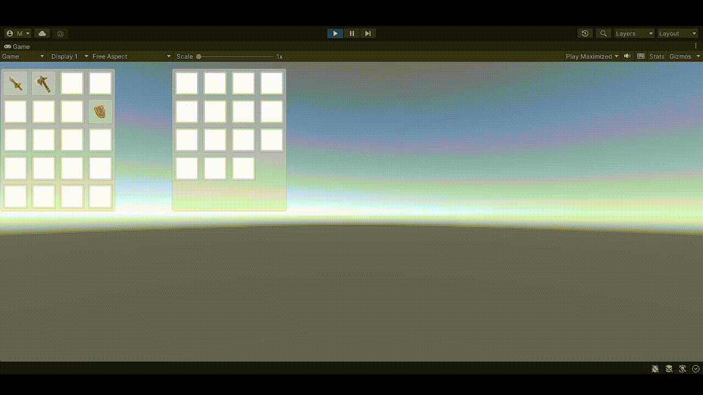
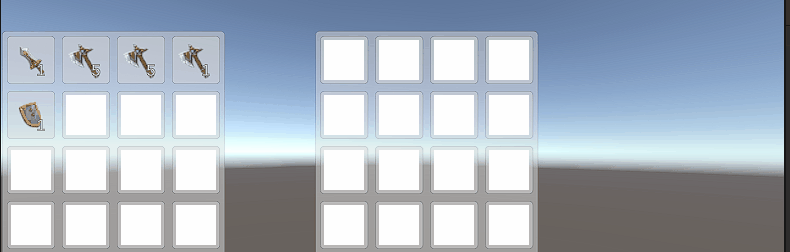

<h1>Simple drag and drop inventory system using Unity and Scriptable Objects</h1>
<h5>All items added are tracable by their unique IDs and their parent inventory. This adds support for chests/bank features.</h5>

<h5>Updated items to have their own stack size and added the stack splitting/combining functionality.</h5>

